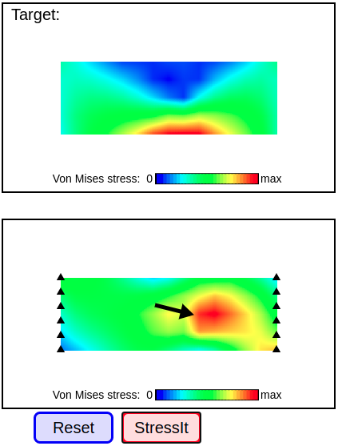

# React WASM demo

This project is a minimal [create-react-app](https://create-react-app.dev/) project that demonstrates how to compile WebAssembly into an ES6 module and use it in a create-react-app React app (without having to eject).

This is useful for getting native performance out of a computation-heavy part of a React app - for example, scientific/engineering simulations, video processing, or any other [WebAssembly Use Case](https://webassembly.org/docs/use-cases/).

## Table of contents
  - [How to run](#how-to-run)
  - [How to get here from a fresh create-react-app](#how-to-get-here-from-a-fresh-create-react-app)
  - [Extending](#extending)
  - [Caveats](#caveats)
  - [Notes](#notes)
    - [Motivation](#motivation)
    - [How I got here](#how-i-got-here)
    - [Explaining the emcc compiler invocation](#explaining-the-emcc-compiler-invocation)
    - [Other helpful resources](#other-helpful-resources)

## How to run

Run `make`.

The default Makefile target will compile `matrixMultiply.c` into `matrixMultiply.mjs`, which is imported in App.js.

After this, you can `npm install` and `npm start` to run the local dev server.

At localhost:3000 (which should be automatically opened by `npm start`), you will briefly see `Loading webassembly...`, then some output which shows some math (which is done using WebAssembly).

## How to get here from a fresh create-react-app

1. Add `src/matrixMultiply.c`
2. Add Makefile with command to compile `src/matrixMultiply.mjs`
3. Add `"ignorePatterns": ["src/matrixMultiply.mjs"]` to `eslintConfig` in package.json
   - This is required because the ES6 module (`.mjs` file) fails linting
4. Import `createModule` from the .mjs file in App.js, instantiate it (which returns a Promise), and resolve the Promise to do things with the resulting module (`Module` in App.js).

All the interesting code is in `src/matrixMultiply.c` and `App.js`.
The Makefile shows how to compile the .c file into the .mjs file.
The ESLint config change is just required to build the app.

## Extending

To make changes to the React code, edit `App.js`.

To make changes to the C code, edit `matrixMultiply.c` and run `make` again.

You can play with the `emcc` command if you need something else from the compiler (`make -B` is useful to force re-run the command during development).

## Caveats

1. If you use this, your app will probably be bigger and might load slower.
   Compiling to single-file .mjs in-lines the WASM content as base64 in the variable `wasmBinaryFile`.
   Base64 encoding adds an overhead of 33% in file size; this will also be loaded with your app instead of being fetched asynchronously.
   Maybe this is fine for you, if you need the WebAssembly to do anything.

## Notes

### Motivation

My friend Louis was writing an educational mechanical engineering game, where you are given the image of a stress distribution and need to draw in the forces that would produce it.



But, it was slow, causing my browser to hang on the larger levels -
in profiling we found almost all the time was spent in a large matrix multiply in a finite element method calculation.

Matrix multiply felt like an ideal use case for WebAssembly: a highly numerical, all-computational task where native performance would help. But when I tried to use WebAssembly with React, it seemed to be very hard without doing one of the following:

- Ejecting from create-react-app to mess with the `webpack` config
- Using `react-app-rewired` or `craco` to mess with webpack without ejecting
- Hosting the .wasm file somewhere else entirely and fetching it

Eventually I ended up with the solution shown here.
Compared against the original implementation with [math.js](https://mathjs.org/), our WASM naive matrix multiply at -O0 (no optimization) was ~50% (1.5x) faster in Chrome and ~5,000% faster (51x) faster in Safari (\*).
It got 10x faster again at -O3, which gave us a new performance bottleneck in a pure JS matrix inversion!
There is a lot more performance to squeeze out: this matrix multiply implementation can get a lot faster (as any [213/CS:APP](http://csapp.cs.cmu.edu/) student would know from Cache Lab), and we can continue to move more work into the WASM module.
That work is still in progress, but when it's done I'll link it here.

\* I didn't look into why this was such a big difference (or if it was some mistake in recording times).
The pure JS code was faster in Chrome than in Safari, maybe because of V8 engine performance over JavaScriptCore.
But, Safari's WASM code also ran twice as fast as Chrome's WASM code.

### How I got here

Most of the intro-to-WebAssembly-type articles I found while my search involved using compiling to a .wasm file, and then fetching and instantiating it with `instantiateStreaming`.
I instantly ran into problems when I tried this with create-react-app, because the default webpack configuration wouldn't let me serve a .wasm file.
The rest of the intro articles used `.html` scaffolding targets - I also had issues getting this to work with create-react-app.

So, initially I would generate an .wasm file, and use the approach from [sipavlovic/wasm2js](https://github.com/sipavlovic/wasm2js) to include it as base64 (you can see this in older commits on this repo).
This worked well for my simple "add two integers" function.
But I ran into issues when I needed methods on the `Module` object to work with memory to pass around arrays for matrixMultiply.

Eventually I figured out `emcc` can directly generate ES6 Javascript modules, with base64-inlined code!

```
-o <target>

    [link] When linking an executable, the target file name extension defines the output type to be generated:

            <name> .mjs : ES6 JavaScript module (+ separate <name>.wasm file if emitting WebAssembly).
```

Starting from [this cryptic note in the emcc docs](https://emscripten.org/docs/tools_reference/emcc.html), I tried and failed a bunch of times.
With the help of Github issues and source code, I eventually ended up with the command in the Makefile (which is explained line-by-line in the next section).

Honestly I might be missing something, but I'll try writing this up and contributing back to docs and hopefully someone can check it.

### Explaining the emcc compiler invocation

The Makefile target has this command to generate the target `src/matrixMultiply.js`:

```
src/matrixMultiply.mjs: src/matrixMultiply.c
	emcc --no-entry src/matrixMultiply.c -o src/matrixMultiply.mjs  \
	  -s ENVIRONMENT='web'  \
	  -s SINGLE_FILE=1  \
	  -s EXPORT_NAME='createModule'  \
	  -s USE_ES6_IMPORT_META=0  \
	  -s EXPORTED_FUNCTIONS='["_add", "_matrixMultiply", "_malloc", "_free"]'  \
	  -s EXPORTED_RUNTIME_METHODS='["ccall", "cwrap"]'
```

Let's go line-by-line.

-------

```
emcc --no-entry src/matrixMultiply.c -o src/matrixMultiply.mjs  \
```

`emcc src/matrixMultiply.c -o src/matrixMultiply.mjs` says, compile the source .c file into a .mjs file (ES6 Javascript module).

`--no-entry` is an argument for the linker `wasm-ld` that says we do not have an entrypoint (by default, the main() function).
This is because we basically have a library that we are just picking functions out of.

-------

```
-s ENVIRONMENT='web'  \
```

All of the `-s` options are documented only in the [settings.js source code](https://github.com/emscripten-core/emscripten/blob/main/src/settings.js), not anywhere on the docs site.

Here we want to run in the normal web environment for our React app.
So, we disable the environments for webview, web worker, Node.js, and JS shell because we will never run there.

-------

```
-s SINGLE_FILE=1  \
```

This option inlines the .wasm file into the .mjs file, as the base64 string `wasmBinaryFile`.
This is the main change that allows us to run our code without changing the webpack configuration.

-------

```
-s EXPORT_NAME='createModule'  \
```

Since we set the output type as `.mjs` above, emcc will [automatically set MODULARIZE=1 and EXPORT_ES6=1](https://github.com/emscripten-core/emscripten/blob/5f45300c9997d5f13f6f8c008e91c8cf5ba74399/emcc.py#L1215-L1217).
This will create an ES6 Javascript module, with a function that returns a Promise that resolves to the Module object (that is constantly referred to in the docs).

By default, that factory function is called `Module`, which is confusing because to use it you would need to write something like this:

```javascript
import Module from "./matrixMultiply.mjs";
const myModule = await Module();
myModule.ccall(/* or whatever */);
```

...even though the emscripten docs constantly refer to `Module.ccall`, `Module._malloc`, and so on.

So instead, we follow [the advice in the FAQ](https://emscripten.org/docs/getting_started/FAQ.html?highlight=modularize#how-can-i-tell-when-the-page-is-fully-loaded-and-it-is-safe-to-call-compiled-functions) to rename it to `createModule`.

-------

```
-s USE_ES6_IMPORT_META=0  \
```

By default, the generated module uses `import.meta.url`.
This caused my webpack to error out with `Module parse failed: Unexpected token`; setting USE_ES6_IMPORT_META=0 falls back to a polyfill which does run without error:

```diff
-  var _scriptDir = import.meta.url;
+  var _scriptDir = typeof document !== 'undefined' && document.currentScript ? document.currentScript.src : undefined;
```

^ This diff shows the change when setting that flag to 0.

-------

```
-s EXPORTED_FUNCTIONS='["_add", "_matrixMultiply", "_malloc", "_free"]'  \
```

Exporting these C function names [ensures that they will not be optimized out](https://emscripten.org/docs/getting_started/FAQ.html?highlight=exported_functions#why-do-functions-in-my-c-c-source-code-vanish-when-i-compile-to-javascript-and-or-i-get-no-functions-to-process).
Actually, since we have `EMSCRIPTEN_KEEPALIVE` on `add` and `matrixMultiply`, we technically don't need these here.
But I think it's nice to have explicit reminders of what these functions are, plus it adds a little snippet that aborts with error if you mistakenly call `._add()` or `._matrixMultiply()` on the Promise (as opposed to the Module that the Promise resolves to).

-------

```
-s EXPORTED_RUNTIME_METHODS='["ccall", "cwrap"]'
```

These are the standard ways to call compiled C functions from Javascript.
In the example App.js, we use `cwrap` to get functions that we can call again later.
We could also use `ccall` to make a single call to the function.
See [Emscripten docs](https://emscripten.org/docs/porting/connecting_cpp_and_javascript/Interacting-with-code.html?highlight=ccall#interacting-with-code-ccall-cwrap) for more info.

-------

### Other helpful resources

- The memory management code in `wrapMatrixMultiply` is pretty tedious - Dan Ruta's post on [Passing and returning WebAssembly array parameters](https://becominghuman.ai/passing-and-returning-webassembly-array-parameters-a0f572c65d97) was helpful to me, and their package [wasm-arrays](https://github.com/DanRuta/wasm-arrays) looks useful for 1-D arrays.
